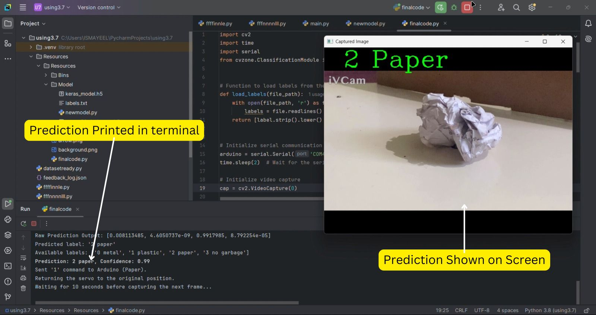
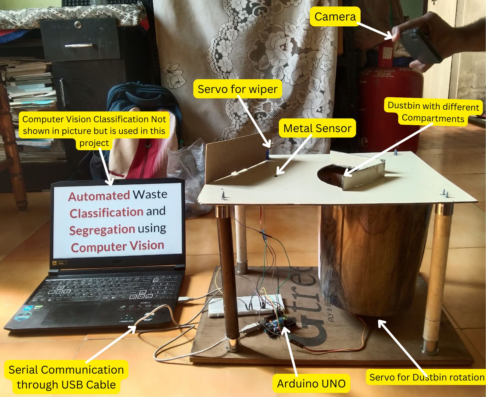
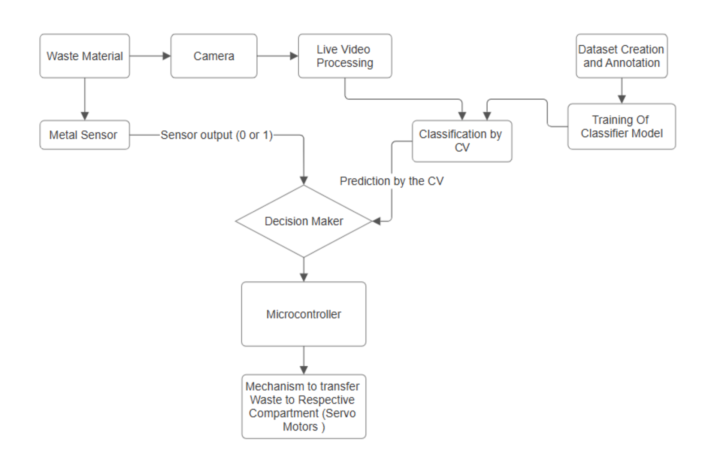

# Automated Waste Segregation — 3-Class (Paper, Plastic, Metal)

This repository contains a clean, GitHub-ready implementation of an **automated waste segregation** system:
- **ML classification (3 classes):** paper, plastic, metal
- **Computer Vision:** OpenCV + TensorFlow/Keras (MobileNetV2 transfer learning)
- **Arduino actuation:** MG995 bin rotation + SG90 wiper
- **Sensor:** KY-036 metal touch sensor override for metal

## 📦 Dataset
We use the **Garbage Classification V2** dataset on Kaggle, but **only 3 classes** are used:
- paper
- plastic
- metal

Kaggle link: https://www.kaggle.com/datasets/sumn2u/garbage-classification-v2

After downloading & extracting, keep only these folders:
```
data/raw/
├── paper/
├── plastic/
└── metal/
```

## 🚀 Setup
```bash
python -m venv .venv && source .venv/bin/activate    # Windows: .venv\Scripts\activate
pip install -r requirements.txt
```

### Train
```bash
python src/train.py --data_dir data/raw --img_size 224 --epochs 15 --freeze 100 --model_out artifacts/model.h5
```

### Evaluate (confusion matrix + curves saved to docs/images/)
```bash
python src/eval.py --data_dir data/raw --model artifacts/model.h5 --img_size 224
```

### Live Inference + Send to Arduino
```bash
python src/infer_and_send.py --model artifacts/model.h5 --labels artifacts/labels.json --port COM4 --baud 9600 --img_size 224
# Use your actual serial port (e.g., /dev/ttyUSB0)
```

## 🔌 Arduino
The Arduino reads single-byte codes:
- `1` → paper
- `2` → plastic
- `3` → metal
- `0` → idle/reset

If the **KY-036** sensor reads HIGH on the digital pin, it **overrides** to metal regardless of the last code.

Upload the sketch in `arduino/WasteSorter/WasteSorter.ino` using the Arduino IDE.

## 📸 Demonstration
**Prediction in PyCharm (Terminal + Screen)**  


**Complete Hardware Setup**  


## 🔁 Project Flow


## 📁 Repo Layout
```
waste-segregation-3class-repo/
├── README.md
├── requirements.txt
├── LICENSE
├── data/
│   ├── raw/            # put the three class folders here
│   └── README.md
├── artifacts/          # models & labels.json will be created here
├── src/
│   ├── train.py
│   ├── eval.py
│   ├── infer_and_send.py
│   └── utils.py
├── arduino/
│   └── WasteSorter/WasteSorter.ino
└── docs/
    └── images/
        ├── prediction_terminal.jpg
        ├── camera_setup.jpg
        └── flow_diagram.png
```

## 📝 Notes
- Keep grounds common across Arduino, external 5V supply, and sensors.
- Don’t power MG995/SG90 directly from Arduino 5V.
- Tune KY-036 sensitivity using its onboard potentiometer and (optionally) analog thresholding.

MIT License.
